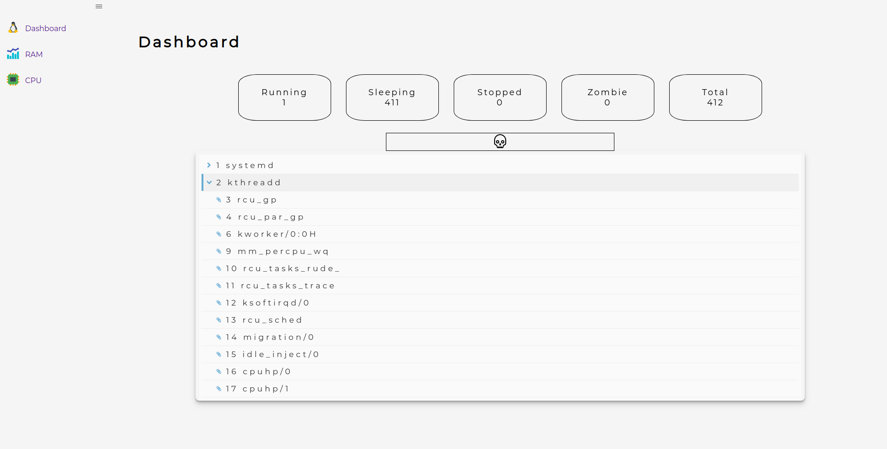

### Universidad de San Carlos de Guatemala

### Facultad de Ingeniería

### Escuela de Ciencias y Sistemas

### Sistemas operativos 1

## Documentación


<div>
    <p align="center">
        
  <p>
</div>

<hr>
<br>
<div>
    <table>
        <tr>
            <th>Nombre</th>
            <th>Carnet</th>
        </tr>
        <tr>
            <th>Cristian Alexander Gomez Guzman</th>
            <th>201801480</th>
        </tr>
    </table>
</div>
<br>
<hr>


## Creación de un modulo

### Metodo modulo_init crea el archivo con nombre memo_201801480 e impreme en el buffer 201801480 correspondiente al carnet del desarrollador
### esto sucede cuando se monta el modulo (insmod).
```c

    static int __init modulo_init(void) {
        proc_create("memo_201801480", 0, NULL, &archivo_operaciones);
        printk(KERN_INFO "201801480\n");

        return 0;
    }
```

### Metodo modulo_cleanup 
### Sucede al remover el modulo con el comando rmmod
```c
    static void __exit modulo_cleanup(void){
        remove_proc_entry("memo_201801480", NULL);    
        printk(KERN_INFO "SISTEMAS OPERATIVOS 1\n");
    }
```

### Módulo de RAM
### Librerias utilizadas para obtener los datos de la RAM.

```c
    #include <linux/module.h>
    #include <linux/proc_fs.h>
    #include <linux/sysinfo.h> 
    #include <linux/seq_file.h>
    #include <linux/mm.h>

```
### si_memifo(_) carga la estructura de sysinfo
```c
    // Se utlizo los siguietes atributos
    struct sysinfo {
        unsigned long totalram;  /* Memoria total */
        unsigned long freeram;   /* Memoria libre */
        unsigned long sharedram; /* Memroria compartida */
        unsigned long bufferram; /* Memoria usada por el buffer */
    };
``` 

### Módulo de CPU
### Las librerías utilizadas para obtener los datos del cpu:

```c
    #include <linux/module.h> // THIS_MODULE, MODULE_VERSION, ...
    #include <linux/init.h>  // module_{init,exit}
    #include <linux/proc_fs.h>
    #include <linux/sched/signal.h> // for_each_process()
    #include <linux/seq_file.h>
    #include <linux/fs.h>
    #include <linux/sched.h>
    #include <linux/mm.h> // get_mm_rss()
```

### for_each_process(task) macro para obtener los procesos 
### cada iteración es un proceso
```c
    for_each_process(task)
``` 
### list_for_each recorre los procesos hijos de un proceso.
```c
    struct list_head *list;     
    list_for_each(list, _){}
``` 

### Archivo Makefile
### Ejecuta los comandos de compilación 
```console
    obj-m += <insert_name_modulo>.o
    all:
        make -C /lib/modules/$(shell uname -r)/build M=$(shell pwd) 
    clean:
        make -C /lib/modules/$(shell uname -r)/build M=$(shell pwd) clean
``` 


## Comandos utilizados

```console
    Compilar el módulo creado
    - make all
    Limpia los arhivos generados al ejecutar el comando make all
    - make clean
    Mouestra el logs del buffer 
    - sudo dmesg
    Limpia los logs del buffer
    - sudo dmesg -C
    Insertar un modulo kernel
    - sudo insmod <modul_name>.ko
    Quitar un módulo kernel
    - sudo rmmod <modul_name>.ko
    Muestra los datos del archivo que genera el módulo
    - cat /proc/<modul_name>
    Lista los modulos cargados
    - lsmod
```

## Aplicación

### Pantalla principal
### Es en esta patanlla se listan los procesos y estos pueden ser aniquilados.
<div>
    <p align="center">
        
  <p>
</div>

### Arbol de procesos con sus procesos hijos.

<div>
    <p align="center">
        
  <p>
</div>

### Monitor de RAM
### Monitoreo del esta de la ram ademas de una grafica para ver su uso en tiempo real.

<div>
    <p align="center">
        
  <p>
</div>

### Monitor de CPU
### Monitoreo del estado de uso del CPU ademas de una grafica para ver su uso en tiempo real.

<div>
    <p align="center">
        
  <p>
</div>

## Created by
[Cristian Gomez](https://github.com/cgomez29)